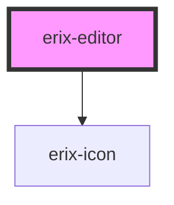

# erix-editor

<!-- Auto Generated Below -->

## Properties

| Property      | Attribute     | Description                            | Type     | Default             |
| ------------- | ------------- | -------------------------------------- | -------- | ------------------- |
| `placeholder` | `placeholder` | Placeholder text when editor is empty. | `string` | `'Start typing...'` |
| `theme`       | `theme`       | The editor theme.                      | `string` | `'light'`           |

## Dependencies

### Depends on

- [erix-icon](../erix-icon)

### Graph

---

_Built with [StencilJS](https://stenciljs.com/)_
