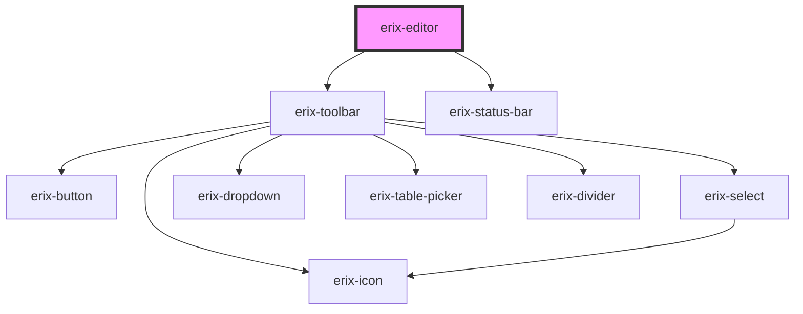

# erix-editor

The main rich text editor component with built-in toolbar, status bar, and plugin system.

<!-- Auto Generated Below -->

## Properties

| Property          | Attribute     | Description | Type                 | Default             |
| ----------------- | ------------- | ----------- | -------------------- | ------------------- |
| `config`          | --            |             | `EditorConfig`       | `undefined`         |
| `content`         | `content`     |             | `string`             | `undefined`         |
| `disabledPlugins` | --            |             | `string[]`           | `undefined`         |
| `placeholder`     | `placeholder` |             | `string`             | `'Start typing...'` |
| `plugins`         | --            |             | `ErixPluginConfig[]` | `undefined`         |
| `readonly`        | `readonly`    |             | `boolean`            | `false`             |
| `theme`           | `theme`       |             | `string`             | `'light'`           |

## Methods

### `getAPI() => Promise<ErixEditorAPI>`

#### Returns

Type: `Promise<ErixEditorAPI>`

## Dependencies

### Depends on

- [erix-toolbar](../toolbar)
- [erix-status-bar](../ui/erix-status-bar)

### Graph

----------------------------------------------

*Built with [StencilJS](https://stenciljs.com/)*
