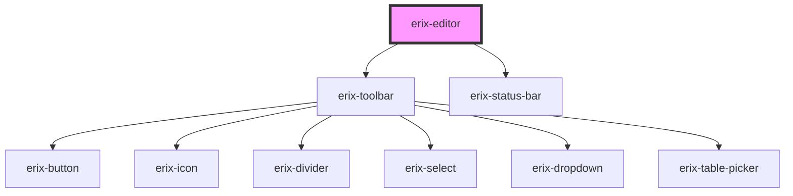

# erix-editor

The main rich text editor component with built-in toolbar, status bar, and plugin system.

<!-- Auto Generated Below -->

## Properties

| Property          | Attribute     | Description                                                                             | Type                 | Default             |
| ----------------- | ------------- | --------------------------------------------------------------------------------------- | -------------------- | ------------------- |
| `config`          | --            | Editor configuration object. Use this to configure plugins, toolbar, and other settings | `EditorConfig`       | `undefined`         |
| `content`         | `content`     | Initial content (HTML string)                                                           | `string`             | `undefined`         |
| `disabledPlugins` | --            | Disabled plugin IDs. Shorthand for config.plugins.disabled                              | `string[]`           | `undefined`         |
| `placeholder`     | `placeholder` | Placeholder text when editor is empty                                                   | `string`             | `'Start typing...'` |
| `plugins`         | --            | Custom plugins to register. Shorthand for config.plugins.custom                         | `ErixPluginConfig[]` | `undefined`         |
| `readonly`        | `readonly`    | Whether the editor is read-only                                                         | `boolean`            | `false`             |
| `theme`           | `theme`       | The editor theme                                                                        | `string`             | `'light'`           |

## Methods

### `getAPI() => Promise<ErixEditorAPI>`

Get the public API instance.

#### Returns

Type: `Promise<ErixEditorAPI>`

The ErixEditorAPI instance

## Dependencies

### Depends on

- [erix-toolbar](../toolbar)
- [erix-status-bar](../ui/erix-status-bar)

### Graph

---

_Built with [StencilJS](https://stenciljs.com/)_
