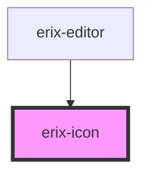

# erix-icon

<!-- Auto Generated Below -->

## Properties

| Property            | Attribute | Description                                        | Type                                                                                                                                                                                                                                                                                                                | Default     |
| ------------------- | --------- | -------------------------------------------------- | ------------------------------------------------------------------------------------------------------------------------------------------------------------------------------------------------------------------------------------------------------------------------------------------------------------------- | ----------- |
| `name` _(required)_ | `name`    | The name of the semantic editor icon.              | `"bulletList" \| "darkMode" \| "formatBold" \| "formatHeading" \| "formatItalic" \| "formatStrikethrough" \| "formatUnderline" \| "lightMode" \| "numberList" \| "pageBreak" \| "print" \| "redo" \| "textAlignCenter" \| "textAlignJustify" \| "textAlignLeft" \| "textAlignRight" \| "textLineSpacing" \| "undo"` | `undefined` |
| `size`              | `size`    | The size of the icon in pixels (width and height). | `number`                                                                                                                                                                                                                                                                                                            | `20`        |

## Dependencies

### Used by

 - [erix-editor](../erix-editor)

### Graph

----------------------------------------------

*Built with [StencilJS](https://stenciljs.com/)*
