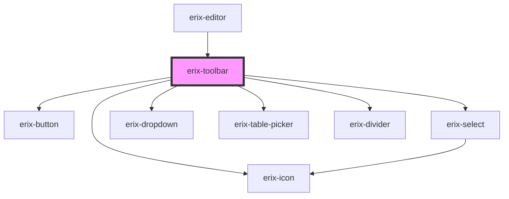

# erix-toolbar

The main toolbar component for the editor. Renders formatting buttons, dropdowns, and other controls based on the configured items.

<!-- Auto Generated Below -->

## Properties

| Property          | Attribute           | Description                                                                                                                                                                   | Type            | Default     |
| ----------------- | ------------------- | ----------------------------------------------------------------------------------------------------------------------------------------------------------------------------- | --------------- | ----------- |
| `items`           | --                  | Toolbar items to display. Array of plugin IDs. Use '\|' for separator (only shown between different groups). Example: ['bold', 'italic', '\|', 'bullet-list', 'ordered-list'] | `ToolbarItem[]` | `[]`        |
| `showThemeToggle` | `show-theme-toggle` | Show theme toggle in toolbar                                                                                                                                                  | `boolean`       | `true`      |
| `theme`           | `data-theme`        | Current theme                                                                                                                                                                 | `string`        | `'light'`   |
| `view`            | --                  | Reference to the ProseMirror EditorView                                                                                                                                       | `EditorView`    | `undefined` |

## Events

| Event         | Description                                  | Type                |
| ------------- | -------------------------------------------- | ------------------- |
| `themeToggle` | Event emitted when theme toggle is requested | `CustomEvent<void>` |

## Methods

### `updateActiveFormats() => Promise<void>`

Call this method from the parent to refresh the toolbar state

#### Returns

Type: `Promise<void>`

## Dependencies

### Used by

 - [erix-editor](../erix-editor)

### Depends on

- [erix-button](../ui/erix-button)
- [erix-icon](../ui/erix-icon)
- [erix-select](../ui/erix-select)
- [erix-dropdown](../ui/erix-dropdown)
- [erix-table-picker](../ui/table-picker)
- [erix-divider](../ui/erix-divider)

### Graph

----------------------------------------------

*Built with [StencilJS](https://stenciljs.com/)*
