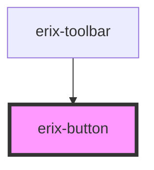

# erix-button

<!-- Auto Generated Below -->

## Properties

| Property      | Attribute      | Description                                      | Type                                | Default     |
| ------------- | -------------- | ------------------------------------------------ | ----------------------------------- | ----------- |
| `active`      | `active`       | Whether the button is in an active/pressed state | `boolean`                           | `false`     |
| `buttonTitle` | `button-title` | Tooltip text for the button                      | `string`                            | `''`        |
| `disabled`    | `disabled`     | Whether the button is disabled                   | `boolean`                           | `false`     |
| `size`        | `size`         | The size of the button                           | `"lg" \| "md" \| "sm"`              | `'md'`      |
| `variant`     | `variant`      | The visual style variant of the button           | `"default" \| "ghost" \| "outline"` | `'default'` |

## Events

| Event       | Description                        | Type                      |
| ----------- | ---------------------------------- | ------------------------- |
| `erixClick` | Emitted when the button is clicked | `CustomEvent<MouseEvent>` |

## Dependencies

### Used by

- [erix-toolbar](../../toolbar)

### Graph

---

_Built with [StencilJS](https://stenciljs.com/)_
