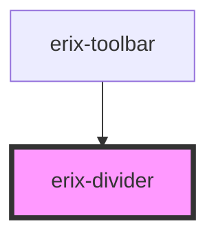

# erix-divider

A visual separator component used in toolbars to group related actions.

<!-- Auto Generated Below -->

## Properties

| Property      | Attribute     | Description                    | Type                         | Default      |
| ------------- | ------------- | ------------------------------ | ---------------------------- | ------------ |
| `orientation` | `orientation` | The orientation of the divider | `"horizontal" \| "vertical"` | `'vertical'` |
| `size`        | `size`        | The size of the divider        | `"lg" \| "md" \| "sm"`       | `'md'`       |

## Dependencies

### Used by

 - [erix-toolbar](../../toolbar)

### Graph

----------------------------------------------

*Built with [StencilJS](https://stenciljs.com/)*
