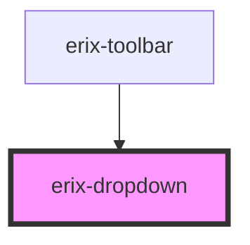

# erix-dropdown

A dropdown menu component with customizable trigger and menu positioning.

<!-- Auto Generated Below -->

## Properties

| Property          | Attribute           | Description                                                 | Type                | Default  |
| ----------------- | ------------------- | ----------------------------------------------------------- | ------------------- | -------- |
| `extended`        | `extended`          | Whether to use extended menu style (for text-based options) | `boolean`           | `false`  |
| `open`            | `open`              | Whether the dropdown menu is currently open                 | `boolean`           | `false`  |
| `position`        | `position`          | Position of the dropdown menu relative to the trigger       | `"left" \| "right"` | `'left'` |
| `showActiveState` | `show-active-state` | Whether the trigger should show active state when open      | `boolean`           | `true`   |
| `triggerTitle`    | `trigger-title`     | Tooltip text for the trigger button                         | `string`            | `''`     |

## Dependencies

### Used by

 - [erix-toolbar](../../toolbar)

### Graph

----------------------------------------------

*Built with [StencilJS](https://stenciljs.com/)*
