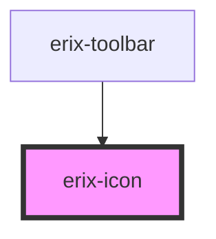

# erix-icon

<!-- Auto Generated Below -->

## Properties

| Property            | Attribute | Description                                        | Type                                                                                                                                                                                                                                                                                                                                                                                                  | Default     |
| ------------------- | --------- | -------------------------------------------------- | ----------------------------------------------------------------------------------------------------------------------------------------------------------------------------------------------------------------------------------------------------------------------------------------------------------------------------------------------------------------------------------------------------- | ----------- |
| `name` _(required)_ | `name`    | The name of the semantic editor icon.              | `"print" \| "undo" \| "redo" \| "importFromWord" \| "pageBreak" \| "formatBold" \| "formatHeading" \| "formatItalic" \| "formatUnderline" \| "formatStrikethrough" \| "bulletList" \| "numberList" \| "lightMode" \| "darkMode" \| "textAlignJustify" \| "textAlignLeft" \| "textAlignRight" \| "textAlignCenter" \| "textLineSpacing" \| "superScript" \| "subScript" \| "upperCase" \| "lowerCase"` | `undefined` |
| `size`              | `size`    | The size of the icon in pixels (width and height). | `number`                                                                                                                                                                                                                                                                                                                                                                                              | `20`        |

## Dependencies

### Used by

 - [erix-toolbar](../../toolbar)

### Graph

----------------------------------------------

*Built with [StencilJS](https://stenciljs.com/)*
