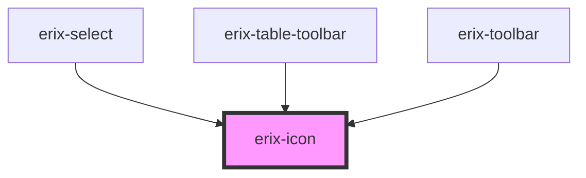

# erix-icon

A semantic icon component for the editor. Renders SVG icons based on the icon name.

<!-- Auto Generated Below -->

## Properties

| Property            | Attribute | Description                                        | Type                                                                                                                                                                                                                                                                                                                                                                                                                                                                                                                                                                                                                                                                                   | Default     |
| ------------------- | --------- | -------------------------------------------------- | -------------------------------------------------------------------------------------------------------------------------------------------------------------------------------------------------------------------------------------------------------------------------------------------------------------------------------------------------------------------------------------------------------------------------------------------------------------------------------------------------------------------------------------------------------------------------------------------------------------------------------------------------------------------------------------- | ----------- |
| `name` _(required)_ | `name`    | The name of the semantic editor icon.              | `"blockQuote" \| "bulletList" \| "column" \| "darkMode" \| "delete" \| "fontFamily" \| "formatBold" \| "formatHeading" \| "formatItalic" \| "formatStrikethrough" \| "formatUnderline" \| "importFromWord" \| "lightMode" \| "lowerCase" \| "numberList" \| "pageBreak" \| "print" \| "redo" \| "row" \| "subScript" \| "superScript" \| "table" \| "tableAddColumnAfter" \| "tableAddColumnBefore" \| "tableAddRowAfter" \| "tableAddRowBefore" \| "tableDelete" \| "tableDeleteColumn" \| "tableDeleteRow" \| "tableMergeCells" \| "tableSplitCell" \| "textAlignCenter" \| "textAlignJustify" \| "textAlignLeft" \| "textAlignRight" \| "textLineSpacing" \| "undo" \| "upperCase"` | `undefined` |
| `size`              | `size`    | The size of the icon in pixels (width and height). | `number`                                                                                                                                                                                                                                                                                                                                                                                                                                                                                                                                                                                                                                                                               | `20`        |

## Dependencies

### Used by

 - [erix-select](../erix-select)
 - [erix-table-toolbar](../table-toolbar)
 - [erix-toolbar](../../toolbar)

### Graph

----------------------------------------------

*Built with [StencilJS](https://stenciljs.com/)*
