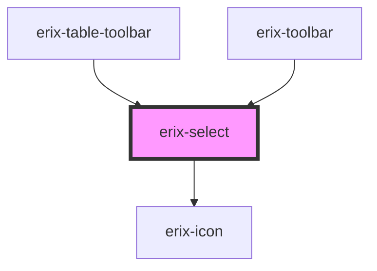

# erix-select

A styled select/dropdown component for choosing from a list of options.

<!-- Auto Generated Below -->

## Properties

| Property      | Attribute      | Description                                                                  | Type                             | Default     |
| ------------- | -------------- | ---------------------------------------------------------------------------- | -------------------------------- | ----------- |
| `disabled`    | `disabled`     | Whether the select is disabled                                               | `boolean`                        | `false`     |
| `iconOnly`    | `icon-only`    | Icon-only mode - displays only an icon in the trigger (for compact toolbars) | `boolean`                        | `false`     |
| `options`     | --             | Array of options for the select                                              | `SelectOption[]`                 | `[]`        |
| `selectTitle` | `select-title` | Tooltip text for the select                                                  | `string`                         | `''`        |
| `triggerIcon` | `trigger-icon` | Icon name to display in the trigger (used with iconOnly mode)                | `string`                         | `undefined` |
| `value`       | `value`        | The currently selected value                                                 | `string`                         | `''`        |
| `width`       | `width`        | Width variant                                                                | `"auto" \| "lg" \| "md" \| "sm"` | `'md'`      |

## Events

| Event        | Description                        | Type                  |
| ------------ | ---------------------------------- | --------------------- |
| `erixChange` | Emitted when the selection changes | `CustomEvent<string>` |

## Dependencies

### Used by

 - [erix-table-toolbar](../table-toolbar)
 - [erix-toolbar](../../toolbar)

### Depends on

- [erix-icon](../erix-icon)

### Graph

----------------------------------------------

*Built with [StencilJS](https://stenciljs.com/)*
