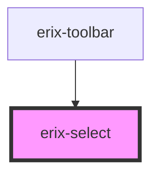

# erix-select

A styled select/dropdown component for choosing from a list of options.

<!-- Auto Generated Below -->

## Properties

| Property      | Attribute      | Description                     | Type                             | Default |
| ------------- | -------------- | ------------------------------- | -------------------------------- | ------- |
| `disabled`    | `disabled`     | Whether the select is disabled  | `boolean`                        | `false` |
| `options`     | --             | Array of options for the select | `SelectOption[]`                 | `[]`    |
| `selectTitle` | `select-title` | Tooltip text for the select     | `string`                         | `''`    |
| `value`       | `value`        | The currently selected value    | `string`                         | `''`    |
| `width`       | `width`        | Width variant                   | `"auto" \| "lg" \| "md" \| "sm"` | `'md'`  |

## Events

| Event        | Description                        | Type                  |
| ------------ | ---------------------------------- | --------------------- |
| `erixChange` | Emitted when the selection changes | `CustomEvent<string>` |

## Dependencies

### Used by

- [erix-toolbar](../../toolbar)

### Graph

---

_Built with [StencilJS](https://stenciljs.com/)_
