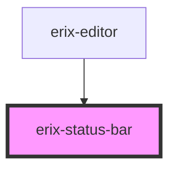

# erix-status-bar

A Word-like status bar component positioned at the bottom of the editor. Displays word/character count and theme toggle.

<!-- Auto Generated Below -->

## Properties

| Property         | Attribute         | Description     | Type     | Default   |
| ---------------- | ----------------- | --------------- | -------- | --------- |
| `characterCount` | `character-count` | Character count | `number` | `0`       |
| `theme`          | `theme`           | Current theme   | `string` | `'light'` |
| `wordCount`      | `word-count`      | Word count      | `number` | `0`       |

## Events

| Event         | Description                                  | Type                |
| ------------- | -------------------------------------------- | ------------------- |
| `themeToggle` | Event emitted when theme toggle is requested | `CustomEvent<void>` |

## Dependencies

### Used by

 - [erix-editor](../../erix-editor)

### Graph

----------------------------------------------

*Built with [StencilJS](https://stenciljs.com/)*
