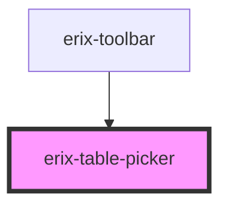

# erix-table-picker

A grid-based table size picker component. Allows users to visually select the number of rows and columns for a new table by hovering over a grid.

<!-- Auto Generated Below -->

## Properties

| Property | Attribute | Description                     | Type     | Default |
| -------- | --------- | ------------------------------- | -------- | ------- |
| `cols`   | `cols`    | Number of columns in the picker | `number` | `8`     |
| `rows`   | `rows`    | Number of rows in the picker    | `number` | `8`     |

## Events

| Event        | Description                                          | Type                                          |
| ------------ | ---------------------------------------------------- | --------------------------------------------- |
| `selectGrid` | Emitted when a grid size is selected (rows and cols) | `CustomEvent<{ rows: number; cols: number }>` |

## Dependencies

### Used by

- [erix-toolbar](../../toolbar)

### Graph

---

_Built with [StencilJS](https://stenciljs.com/)_
