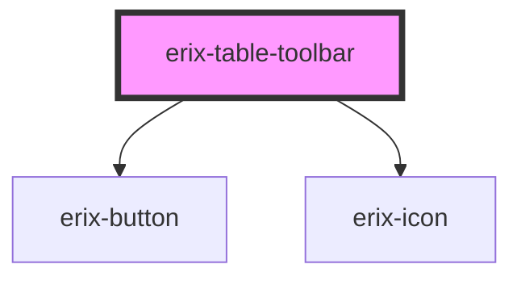

# erix-table-toolbar

A floating toolbar component that appears when the cursor is inside a table. Provides quick access to table manipulation commands like adding/removing rows and columns, merging/splitting cells, and deleting the table.

<!-- Auto Generated Below -->

## Properties

| Property | Attribute | Description                             | Type         | Default     |
| -------- | --------- | --------------------------------------- | ------------ | ----------- |
| `view`   | --        | Reference to the ProseMirror EditorView | `EditorView` | `undefined` |

## Methods

### `update() => Promise<void>`

Force the toolbar to update its state

#### Returns

Type: `Promise<void>`

## Dependencies

### Depends on

- [erix-button](../erix-button)
- [erix-icon](../erix-icon)

### Graph

---

_Built with [StencilJS](https://stenciljs.com/)_
