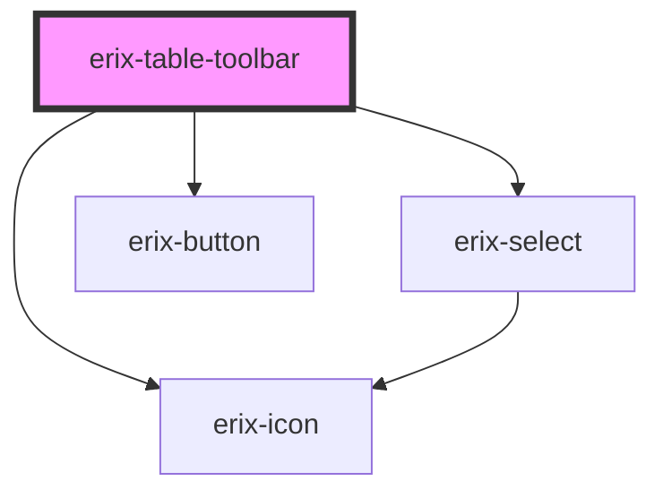

# erix-table-toolbar

A floating toolbar component that appears when the cursor is inside a table. Provides quick access to table manipulation commands like adding/removing rows and columns, merging/splitting cells, and deleting the table.

<!-- Auto Generated Below -->

## Properties

| Property | Attribute | Description | Type         | Default     |
| -------- | --------- | ----------- | ------------ | ----------- |
| `view`   | --        |             | `EditorView` | `undefined` |

## Methods

### `update() => Promise<void>`

#### Returns

Type: `Promise<void>`

## Dependencies

### Depends on

- [erix-select](../erix-select)
- [erix-button](../erix-button)
- [erix-icon](../erix-icon)

### Graph

----------------------------------------------

*Built with [StencilJS](https://stenciljs.com/)*
